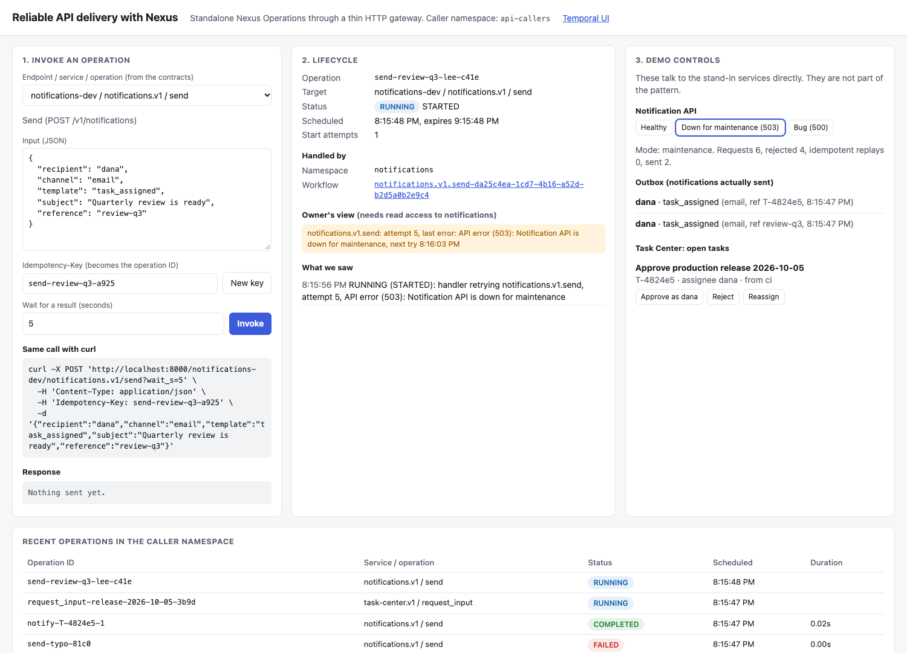
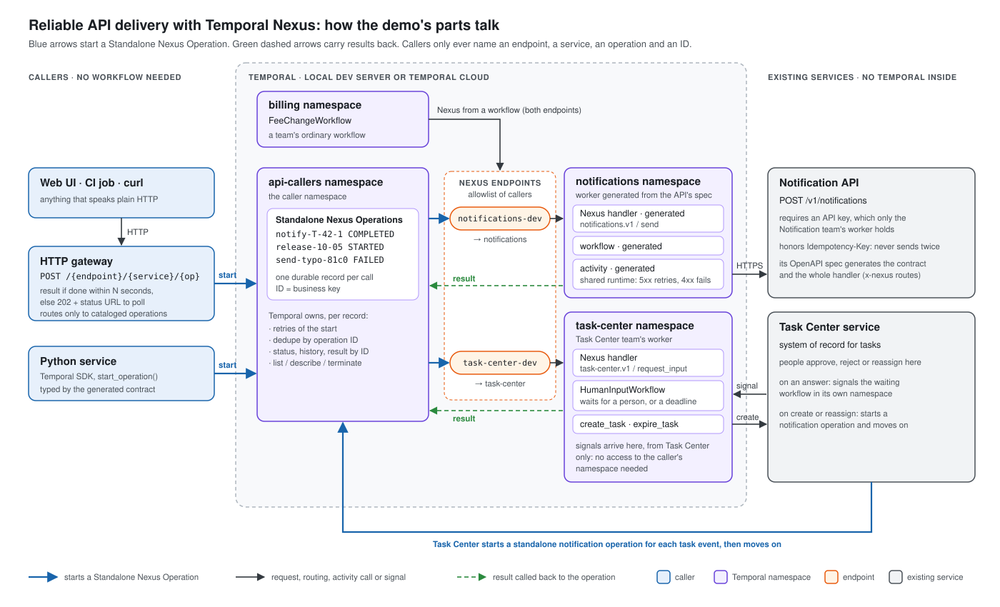

# Reliable API delivery with Temporal Nexus

Put [Temporal Nexus](https://docs.temporal.io/nexus) in front of APIs and workflows you already have. Every call gets durable retries, deduplication and a lifecycle you can watch, and the caller does not have to write a workflow.

> [!WARNING]
> [Standalone Nexus Operations](https://docs.temporal.io/standalone-nexus-operation) are **pre-release**. The SDK APIs used here are experimental and may change. Run this against a dev server or a test namespace, not production.



## What it shows

One Nexus setup that any team can reuse, in two scenarios that cover every combination of Temporal and non-Temporal callers and services.

| Path | Scenario | Who calls what |
|---|---|---|
| Non-Temporal → Temporal → non-Temporal | 1 | Task Center service → `notifications-dev` → Notification API |
| Temporal → non-Temporal | 1 | Billing team's workflow → `notifications-dev` → Notification API |
| Non-Temporal → Temporal | 2 | CI job, curl or the web UI → `task-center-dev` → human-in-the-loop workflow |
| Temporal → Temporal | 2 | Billing team's workflow → `task-center-dev` → human-in-the-loop workflow |



**Scenario 1: reliable API delivery.** The Notification team publishes `notifications.v1 / send`, generated from its API's OpenAPI spec. A caller starts a send and moves on. Temporal retries through outages until delivery succeeds or the deadline passes, and the API never sends twice. Only the Notification team's worker holds the API key.

**Scenario 2: workflow as a service.** Task Center publishes `task-center.v1 / request_input`. Any caller asks a person to approve, reject or supply a value, and gets the answer back as the result, even days later. Task Center only signals workflows in its own namespace, so it never needs access to the caller's.

**How callers get in**
- **Python SDK**: one client call from the caller's own namespace ([`examples/`](examples/)).
- **Plain HTTP**: a thin gateway, `POST /{endpoint}/{service}/{operation}`. It returns the result if the work finishes within a few seconds, otherwise a `202` with a status URL to poll.
- **Web UI**: invoke any operation, watch it run, and switch the Notification API between healthy, maintenance and buggy.

[`docs/HOW-IT-WORKS.md`](docs/HOW-IT-WORKS.md) explains the design: naming, error handling, deduplication, security, visibility, and how Nexus terms map to the Temporal primitives you already know.

## Quickstart

Needs Python 3.10+, `curl`, and macOS or Linux.

```bash
git clone https://github.com/aaronaycock/nexus-reliable-api-demo.git && cd nexus-reliable-api-demo
make setup     # venv + a Temporal CLI new enough (1.9+); PYTHON=python3.12 make setup if your python3 is older
make up        # dev server, 2 endpoints, 2 stand-in services, 3 workers, gateway. Ctrl-C to stop.
```

Open **http://localhost:8000**. In a second terminal, `make smoke` runs 18 end-to-end checks. `make down` stops the dev server.

`make up` starts the Temporal dev server with Standalone Nexus Operations turned on (`--dynamic-config-value nexusoperation.enableStandalone=true`). Without that flag every start fails with `Standalone Nexus operation is disabled`.

## Walkthrough (about 10 minutes)

Everything below happens in the web UI unless it says otherwise. Each step ends with what Temporal is doing under the hood.

**The one idea to hold onto.** A Standalone Nexus Operation is a durable record of one Nexus call, owned by the Temporal server and stored in the *caller's* namespace. The caller asks for it once. Temporal delivers the start to the right handler, keeps the record's state, and stores the result for the caller to fetch any time later by ID:

```
client ── start(id, endpoint, service, operation, input) ──> caller namespace: record SCHEDULED
          endpoint routes to the handler's namespace + task queue ──> handler starts a workflow
                                                                 <── record STARTED (+ link to that workflow)
          handler's workflow finishes, completion called back    <── record COMPLETED or FAILED (+ result)
client ── result() / describe() / list() ──> the record
```

1. **A normal call.** Invoke `notifications.v1 / send` as prefilled. It answers `200` with the receipt, and the outbox shows one email.

   *Under the hood:* the gateway calls `start_operation` with your Idempotency-Key as the operation ID. The `notifications-dev` endpoint routes the start to the Notification team's worker, which was generated entirely from the API's OpenAPI spec. It starts a workflow whose activity calls the API. The gateway waits on the result for up to `wait_s` seconds, so a fast operation looks like a normal API call. The caller never sees the handler's namespace, workflow or API key.

2. **A retried call.** Invoke again without changing the Idempotency-Key. Same operation, `replayed: true`, still one email.

   *Under the hood:* the operation ID is unique in the caller namespace. With `REJECT_DUPLICATE` (no new run after the first one closed) and `USE_EXISTING` (attach while it is still running), a retried request can never send twice.

3. **An outage.** Click *Down for maintenance*, press *New key*, and invoke. The gateway answers `202` with a status URL. In *Lifecycle*, the caller sees the operation running, and the owner's view shows the Notification team's worker retrying on `503`. Click *Healthy*: it completes, and the outbox shows exactly one new email.

   *Under the hood:* the start succeeded at once, so the record is `STARTED`. The retries happen inside the handler's workflow, under its activity retry policy. When the API recovers, the workflow completes and Temporal calls the result back to the record. The gateway stopped waiting after 5 seconds, but the operation did not: its result can be fetched later, from anywhere, by ID. The *Handled by* link comes from the link Nexus records between the operation and the handler's workflow. (If the handler's *worker* were down instead, Temporal would retry the start itself: the record alternates between `SCHEDULED` and `BACKING_OFF`, the attempt count grows, and the last error reads `upstream timeout`.)

4. **A bad request.** Change `template` to `task_asigned`: it fails on the first attempt with the API's own `400` message, with no retry loop. Change `channel` to `sms` instead: the generated contract rejects it field by field before the API is ever called.

   *Under the hood:* the 400 makes the handler's activity raise a non-retryable error, so its workflow fails and the failure is called back to the record. The `sms` input never gets that far. The handler's worker decodes the input with the generated contract, validation fails, and the worker answers the start with `BAD_REQUEST`. That is non-retryable, so the record fails immediately and no workflow starts.

5. **A person in the loop.** Pick `task-center.v1 / request_input` and invoke. The task appears under *Task Center*, and the assignee gets an email. *Reassign* it and the new assignee gets one too. *Approve* it, and the operation completes with the answer.

   *Under the hood:* three standalone operations are at work.
   - The request: its handler starts `HumanInputWorkflow` in Task Center's namespace, and the record stays `STARTED` for as long as the person takes, days if need be.
   - The task-created email: Task Center is an ordinary web service. When the task is created, it starts its own standalone operation on `notifications-dev` and moves on (`notify-<task>-1`).
   - The reassignment email: a second operation, `notify-<task>-2`. One operation ID per task event means each event notifies exactly once.

   *Approve* is a plain signal from Task Center to its own workflow. The workflow returns, and the answer is called back as the request's result.

6. **From a CI job.** In a terminal, `make ci-approval`. The script waits on its status URL. Approve the task in the UI, and the script exits 0.

   *Under the hood:* the same operation as step 5, started over plain HTTP through the gateway. The script polls `GET /operations/{id}`, which reads the operation's record. Because the record lives in Temporal, not in the job, a job that restarts can pick up where it left off by ID.

7. **From a team's workflow.** `make fee-change ID=7`. The billing team's workflow asks for approval, applies the change, and emails the requester. Approve it in the UI, then find `fee-change-7` in the [Temporal UI](http://localhost:8233) under the `billing` namespace.

   *Under the hood:* this step uses Nexus from a workflow, **not** a standalone operation. The billing workflow calls both endpoints with `workflow.create_nexus_client`, and each call is recorded as events in the workflow's own history instead of a standalone record. The handlers are the same ones the other steps use: a team publishes once, and both non-Temporal callers (standalone operations) and Temporal workflows (Nexus) can call it.

8. **From Python, no HTTP.** `make example-notify` hands off a notification and waits for delivery. `make example-input` asks for a decision and prints the answer once you approve it in the UI. Both are a few lines in [`examples/`](examples/).

   *Under the hood:* the same `start_operation` the gateway makes, called directly from the Python SDK with typed inputs from the generated contract. No gateway and no workflow.

## Repo map

```
contracts/          the Nexus contracts (source of truth) and the code generated from them
  openapi/          the Notification API's OpenAPI spec, exported by `make codegen`
  facades.yaml      which existing APIs to put behind Nexus, and how to run their handlers
  gen/              Python generated by nexgen. Do not edit.
common/             config (every name, overridable) and http_facade.py, the runtime all facades share
services/           stand-ins for the APIs you already have (no Temporal inside)
  notification_api/ requires an API key, honors Idempotency-Key, has failure switches
  task_center/      system of record for tasks; starts notifications, signals answers
handlers/           one worker per owning team: the Nexus handlers
  notifications/    notifications.v1: GENERATED from the Notification API's OpenAPI spec
  task_center/      task-center.v1: written by hand (it waits for a person)
teams/billing/      a product team's ordinary workflow that calls both endpoints
gateway/            the HTTP gateway and the web UI
examples/           the same calls from plain Python
scripts/            setup, up, down, codegen, smoke test, CI example
deploy/             endpoint inventory for every environment and region, and Terraform examples
config/             environment for running against Temporal Cloud
```

## Add your own capability

**An existing API, as is** (like the Notification API). No handler code to write:

1. **Tag the routes** to publish with `x-nexus` in the API's OpenAPI spec (see `services/notification_api/app.py`). Declare the API key as an `apiKey` security scheme and the `Idempotency-Key` header, as OpenAPI already allows.
2. **Add an entry to [`contracts/facades.yaml`](contracts/facades.yaml):** the namespace and task queue to run in, the base URL and credential settings, the retry policy and the deadline.
3. **`make codegen`** writes the Nexus contract with [nexgen](https://github.com/temporalio/nexgen), and the complete handler (worker, workflow, activity) with `scripts/gen_facade.py`.

**A capability with its own logic** (like Task Center's human-in-the-loop step):

1. **Write the contract** as a `.nexusrpc.yaml` (see `contracts/task-center.nexusrpc.yaml`), then `make codegen` for the types.
2. **Write the handler:** an operation that starts your workflow (see `handlers/task_center/`).

**Either way:**
- **Route it.** Create an endpoint named `<capability>-<stamp>` in every stamp, allowing only that stamp's caller namespaces. `make plan-endpoints` lists them all and can write the Terraform.
- **Expose it over HTTP** (optional). Add the endpoint and an example input to `gateway/catalog.py`.

## Environments and regions

Everything is named per **stamp**, an environment in a region such as `dev`, `staging-us` or `prod-ch`. Callers pick theirs with one setting:

```bash
NEXUS_ENV=prod-ch make up      # endpoints notifications-prod-ch and task-center-prod-ch
NEXUS_ENV=prod-ch make smoke   # same checks, no code changes
make plan-endpoints            # every endpoint, target and allowlist across 5 stamps, and the count math
```

[HOW-IT-WORKS](docs/HOW-IT-WORKS.md#environments-and-regions) explains the naming, how allowlists keep stamps apart, and when to use one endpoint per capability vs. one per team.

## Running on Temporal Cloud

1. Create the namespaces and endpoints. [`deploy/terraform/main.tf`](deploy/terraform/main.tf) shows the shape.
2. Ask Temporal to enable Standalone Nexus Operations on the caller namespace (pre-release).
3. `cp config/cloud.env.example cloud.env`, fill it in, then `make up-cloud`.

Callers and workers then connect with an API key through the `cloud` profile in `temporal.toml`. Nothing in the code changes.

## Learn more

- [Standalone Nexus Operations](https://docs.temporal.io/standalone-nexus-operation) and the [Python guide](https://docs.temporal.io/develop/python/nexus/standalone-operations)
- [Temporal Nexus](https://docs.temporal.io/nexus), [Nexus security](https://docs.temporal.io/nexus/security), [Cloud limits](https://docs.temporal.io/cloud/limits)
- [nexgen](https://github.com/temporalio/nexgen), the contract code generator (pre-release)
